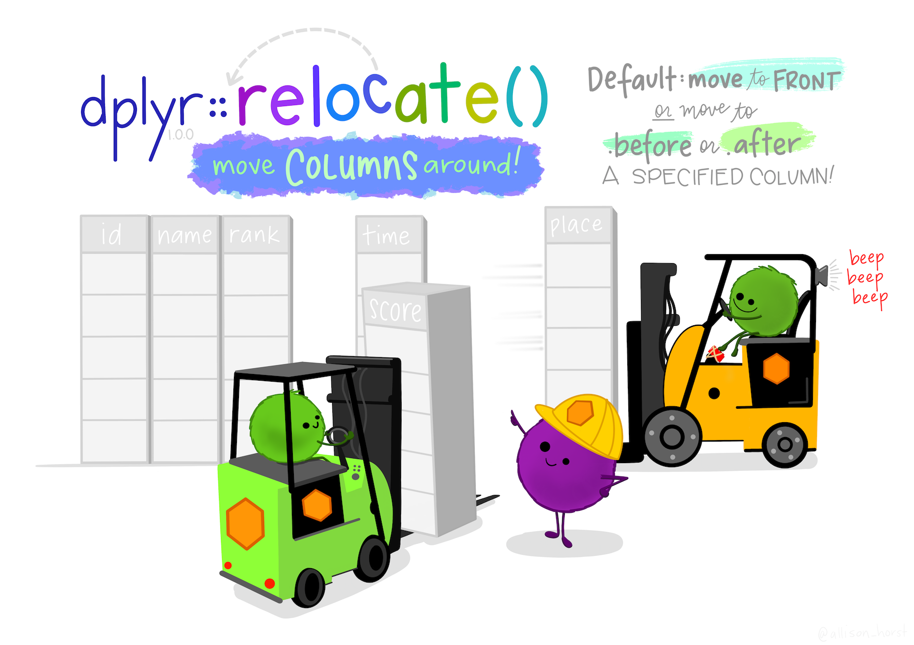

```{r setup, include = FALSE}
# Cartoons from https://github.com/allisonhorst/stats-illustrations
# dplyr based upon https://allisonhorst.shinyapps.io/dplyr-learnr/#section-welcome

source('../config.R')
```

class: center, middle, inverse, title-slide

# `r metadata$title`
## `r metadata$subtitle`
### `r metadata$author`
### `r metadata$date`

---
class: hide-logo, bottom, right, title-slide
background-image: url(images/Greetings_from_Statistics.jpeg)
background-size: contain

.font70[

[@skyetetra](https://twitter.com/ChelseaParlett/status/1340463322118856705)

]

---
# Agenda

.pull-left[
* About your instructor

* Syllabus

* Class meetups

* Course Schedule

* Assignments (how you will be graded)

* Software setup

* Brief introduction to R
]
.pull-right[
While waiting, please complete this formative assessment:


]

---
class: font120
# A little about me...

* Earned my Ph.D. in Educational Pschology and Methodology from the University at Albany. Dissertation: [A National Study Comparing Charter and Traditional Public Schools Using Propensity Score Analysis](https://github.com/jbryer/dissertation)
* Assistant Professor at CUNY in Data Science and Information Systems
* Principal Investigator for a Department of Education Grant (part of their FIPSE First in the World program) to develop a Diagnostic Assessment and Achievement of College Skills ([www.DAACS.net](http://www.daacs.net))  
* Authored over a dozen R packages including:
	* [likert](http://github.com/jbryer/likert)
	* [sqlutils](http://github.com/jbryer/sqlutils)
	* [timeline](http://github.com/jbryer/timeline)
* Specialize in propensity score methods. Three new methods/R packages developed include:
	* [multilevelPSA](http://github.com/jbryer/multilevelPSA)
	* [TriMatch](http://github.com/jbryer/TriMatch)
	* [PSAboot](http://github.com/jbryer/PSAboot)

---

# Also a Father...

```{r, out.width='65%', fig.align='center', echo=FALSE}
knitr::include_graphics('images/BoysFall2019.jpg')
```

---

# Runner...

<table border='0' width='100%'><tr><td>
<center></center>
</td><td>
<center></center>
</td></tr></table>

---

# And photographer.

```{r, out.width='80%', fig.align='center', echo=FALSE}
knitr::include_graphics('images/Sleeping_Empire.jpg')
```


---

# Syllabus `r hexes(c('blogdown', 'rmarkdown'))`

Syllabus and course materials are here: [https://github.com/jbryer/DAV5300-2024-Spring](https://github.com/jbryer/DAV5300-2024-Spring)

We will use Canvas primary for submitting assignments only. Please submit PDFs.

PDFs are preferred for the homework as there is some LaTeX formatting in the R markdown files. The `tineytex` R package helps with install LaTeX, but you can also install LaTeX using [MiKTeX](http://miktex.org) (for Windows) and [BasicTeX](http://www.tug.org/mactex/morepackages.html) (for Mac).

---
class: font90

# Class Meetings

Class will meet every Tuesday at 5:30pm to 7:30pm. 

In order to get the most out of this class attendance is required.

**One Minute Papers** - Complete the one minute paper after each Meetup (whether you watch live or watch the recordings). It should take approximately one to two minutes to complete. 

---
class: font70
# Schedule

```{r schedule-setup, echo=FALSE, warning=FALSE, message=FALSE}
# devtools::install_github("gadenbuie/ggweekly")
library(ggweekly)
library(rlang) # Needed for the ggweekly.R script to work
library(configr)
library(ggplot2)
library(readxl)
library(lubridate)
# library(kableExtra)

options(knitr.kable.NA = '')

semester <- 'Fall 2023'

palette <- c('#8dd3c7','#ffffb3','#bebada','#fb8072','#80b1d3','#fdb462',
			 '#b3de69','#fccde5','#d9d9d9','#bc80bd','#ccebc5','#ffed6f')

lastModified <- format(file.info('../Schedule.xlsx')[1,]$mtime, '%B %d, %Y %I:%M%p')

meetups <- read_excel('../Schedule.xlsx', sheet = 'Meetups')
meetups$day <- as.Date(meetups$Date)
meetups$label <- paste0('Meetup ', meetups$StartTime, '\n', meetups$Topic)
# meetups$label <- meetups$Topic
meetups$color <- '#4A235A'
meetups$fill <- NA

officeHours <- read_excel('../Schedule.xlsx', sheet = 'Office_Hours')
officeHours$day <- as.Date(officeHours$Date)
officeHours$label <- paste0('Office Hours\n', officeHours$StartTime, '')
officeHours$color <- '#145A32'
officeHours$fill <- NA

schedule <- rbind(meetups[,c('day', 'label', 'color', 'fill')],
				  officeHours[,c('day', 'label', 'color', 'fill')])

topics <- read_excel('../Schedule.xlsx', sheet = 'Schedule')
topics$Start <- as.Date(topics$Start)
topics$End <- as.Date(topics$End)
# topics$Topic <- sapply(topics$Topic, markdown::mark) |> unname()
for(i in 1:nrow(topics)) {
	schedule <- rbind(schedule, data.frame(
		day = topics[i,]$Start,
		label = paste0(topics[i,]$Topic, '\n\n\n'),
		color = '#000000',
		fill = palette[i]
	))
	dates <- seq(topics[i,]$Start, topics[i,]$End, by = 'day')[-1]
	for(j in seq_along(dates)) {
		schedule <- rbind(schedule, data.frame(
			day = dates[j],
			label = NA,
			color = NA,
			fill = palette[i]
		))
	}
}

start_day <- lubridate::floor_date(min(meetups$day), "month")
end_day <- lubridate::ceiling_date(max(meetups$day), "month") - 1
```

```{r printTopics, echo=FALSE, warning=FALSE, message=FALSE, results='asis'}
topics$Start <- format(topics$Start, format = '%A, %B %d, %Y')
topics$End <- format(topics$End, format = '%A, %B %d, %Y')
# topics <- topics %>% filter(!is.na(Link)) %>% select(-Link)
knitr::kable(topics[,c('Week', 'Start','End','Topic')], format = 'html', escape = FALSE)
```

---
# Textbooks `r hexes(c('openintro'))`


[*Introduction to Modern Statistics*](materials/imstat.pdf) by Mine Çetinkaya-Rundel and Johanna Hardin - This will be the primary textbook.

[*R for Data Science*](https://r4ds.hadley.nz) by Hadley Wickham and Garrett Grolemund - Recommended reference for those new to R.

[*OpenIntro Statistics*](materials/os4.pdf) by David Diaz, Mine Çetinkaya-Rundel, and Christopher D Barr.


---
class: font90
# Assignments

**Labs** (30%) - Labs are designed to provide you an opportunity to apply statistical concepts using statistical software.

**Textbook questions** (15%) - The assigned questions from the textbook provide an opportunity to assess conceptional understandings.

**Participation** (10%) - You are expected to attend every class and to complete a [one minute paper](https://forms.gle/CD5Qxkq3xtdxSheW8) at the conclusion of class.

**Poster** (25%) - We will hold a poster session on the second to last class. In a group of 2 to 3 students will create poster presenting the results of analysis using a data set of your choice. More details will be provided a few weeks into the class.

**Final exam** (20%) - A multiple choice exam will be given on the last day of class.

**All assignments are due on Sunday.** Assignments submitted late will be penalized. Assignments will not be accepted more than one week after their due date.

---

# Communication

* Email: [jason.bryer@yu.edu](mailto:jason.bryer@yu.edu).

* Canvas

* Office hours before and after class and by appointment.

---
class: inverse, middle, center
# Software Setup

---
# Software `r hexes(c('rmarkdown', 'RStudio', 'tinytex'))`

This is an applied statistics course so we will make extensive use of the [R statistical programming language](https://www.r-project.org).

* Install [R](https://cran.r-project.org) and [RStudio](https://rstudio.com) on your own computer. I encourage everyone to do this at some point by the end of the semester.

You will also need to have [LaTeX](https://www.latex-project.org) installed as well in order to create PDFs. The [`tinytex`](https://yihui.org/tinytex/) R package helps with this process:

```
install.packages('tinytex')
tinytex::install_tinytex()
```

---
class: inverse, middle, center
# Introduction to R


---
# Workflow

.center[

]

.font80[Source: [Wickham & Grolemund, 2017](https://r4ds.had.co.nz)]


---
# Tidy Data

.center[

]

See Wickham (2014) [Tidy data](https://vita.had.co.nz/papers/tidy-data.html).


---
# Types of Data

.pull-left[
* Numerical (quantitative)
	* Continuous
	* Discrete
]
.pull-right[
* Categorical (qualitative)
	* Regular categorical
	* Ordinal
]
.center[

]

---
# Data Types in R

```{r, echo=FALSE, fig.align='center', out.width=1000}
knitr::include_graphics('images/DataTypesConceptModel.png')
```

---
# Data Types / Descriptives / Visualizations


Data Type    |  Descriptive Stats                            | Visualization
-------------|-----------------------------------------------|-------------------|
Continuous   | mean, median, mode, standard deviation, IQR   | histogram, density, box plot
Discrete     | contingency table, proportional table, median | bar plot
Categorical  | contingency table, proportional table         | bar plot
Ordinal      | contingency table, proportional table, median | bar plot
Two quantitative | correlation                               | scatter plot
Two qualitative  | contingency table, chi-squared            | mosaic plot, bar plot
Quantitative & Qualitative | grouped summaries, ANOVA, t-test | box plot

---
# Variance

.pull-left[
Population Variance:
$$ S^2 = \frac{\Sigma (x_i - \bar{x})^2}{N}$$
Consider a dataset with five values (black points in the figure). For the largest value, the deviance is represented by the blue line ( $x_i - \bar{x}$ ).

See also:
https://shiny.rit.albany.edu/stat/visualizess/  
https://github.com/jbryer/VisualStats/

]
.pull-right[

```{r, echo=FALSE, fig.height=12}
x <- c(97.88, 107.91, 88.26, 115.21, 87.38)
variance_vis(x,
			 plot_mean = TRUE,
			 plot_deviances = FALSE,
			 plot_deviances_x = which(x == max(x)),
			 plot_deviances_y = FALSE,
			 plot_sample_variance = FALSE,
			 plot_population_variance = FALSE,
			 plot_population_sd = FALSE)
```
]

---
# Variance (cont.)

.pull-left[
Population Variance:
$$ S^2 = \frac{\Sigma (x_i - \bar{x})^2}{N}$$
In the numerator, we square each of these deviances. We can conceptualize this as a square. Here, we add the deviance in the *y* direction.
]
.pull-right[
```{r, echo=FALSE, fig.height=12}
variance_vis(x,
			 plot_mean = TRUE,
			 plot_deviances = FALSE,
			 plot_deviances_x = which(x == max(x)),
			 plot_deviances_y = which(x == max(x)),
			 plot_sample_variance = FALSE,
			 plot_population_variance = FALSE,
			 plot_population_sd = FALSE)
```
]

---
# Variance (cont.)

.pull-left[
Population Variance:
$$ S^2 = \frac{\Sigma (x_i - \bar{x})^2}{N}$$

We end up with a square.
]
.pull-right[
```{r, echo=FALSE, fig.height=12}
variance_vis(x,
			 plot_mean = TRUE,
			 plot_deviances = which(x == max(x)),
			 plot_deviances_x = which(x == max(x)),
			 plot_deviances_y = which(x == max(x)),
			 plot_sample_variance = FALSE,
			 plot_population_variance = FALSE,
			 plot_population_sd = FALSE)
```
]

---
# Variance (cont.)

.pull-left[
Population Variance:
$$ S^2 = \frac{\Sigma (x_i - \bar{x})^2}{N}$$
We can plot the squared deviance for all the data points. That is, each component in the numerator is the area of each of these squares.
]
.pull-right[
```{r, echo=FALSE, fig.height=12}
variance_vis(x,
			 plot_mean = TRUE,
			 plot_deviances = TRUE,
			 plot_deviances_x = FALSE,
			 plot_deviances_y = FALSE,
			 plot_sample_variance = FALSE,
			 plot_population_variance = FALSE,
			 plot_population_sd = FALSE)
```
]

---
# Variance (cont.)

.pull-left[
Population Variance:
$$ S^2 = \frac{\Sigma (x_i - \bar{x})^2}{N}$$
The variance is therefore the average of the area of all these squares, here represented by the orange square.
]
.pull-right[

```{r, echo=FALSE, fig.height=12}
variance_vis(x,
			 plot_mean = TRUE,
			 plot_deviances = TRUE,
			 plot_deviances_x = FALSE,
			 plot_deviances_y = FALSE,
			 plot_sample_variance = FALSE,
			 plot_population_variance = TRUE,
			 plot_population_sd = FALSE)
```
]

---
# Population versus Sample Variance

.pull-left[
Typically we want the sample variance. The difference is we divide by $n - 1$ to calculate the sample variance. This results in a slightly larger area (variance) then if we divide by $n$.

Population Variance (yellow):
$$ S^2 = \frac{\Sigma (x_i - \bar{x})^2}{N}$$

Sample Variance (green):
$$ s^2 = \frac{\Sigma (x_i - \bar{x})^2}{n-1}$$

]
.pull-right[

```{r, echo=FALSE, fig.height=12}
variance_vis(x,
			 plot_mean = TRUE,
			 plot_deviances = TRUE,
			 plot_deviances_x = FALSE,
			 plot_deviances_y = FALSE,
			 plot_sample_variance = TRUE,
			 plot_population_variance = TRUE,
			 plot_population_sd = FALSE)
```

]

---
# Robust Statistics

Consider the following data randomly selected from the normal distribution:

.pull-left[
```{r, echo=TRUE, fig.height=2}
set.seed(41)
x <- rnorm(30, mean = 100, sd = 15)
mean(x); sd(x)
median(x); IQR(x)
```
]
.pull-right[
```{r, echo=FALSE}
ggplot(data.frame(x = x, y = 0), aes(x = x)) + geom_histogram(bins = 6)
```
]

---
# Robust Statistics

```{r, echo=FALSE, fig.height=2.5}
ggplot() + 
	geom_point(data = data.frame(x = x, y = 0), aes(x = x, y = y), size = 3, alpha = 0.5) +
	geom_segment(aes(y = 0.1, yend = 0.1, x = mean(x) - sd(x), xend = mean(x) + sd(x)), color = 'blue') +
	geom_segment(aes(y = 0.2, yend = 0.2, x = median(x) - IQR(x), xend = median(x) + IQR(x)), color = 'maroon') +
	geom_vline(xintercept = mean(x), linetype = 2, color = 'blue') +
	geom_vline(xintercept = median(x), linetype = 3, color = 'maroon', size = 1.5) +
	geom_text(aes(label = paste0('mean = ', round(mean(x), digits = 2)), x = mean(x) + sd(x), y = 0.1), vjust = -1, color = 'blue') +
	geom_text(aes(label = paste0('median = ', round(median(x), digits = 2)), x = median(x) + sd(x), y = 0.2), vjust = -1, color = 'maroon') +
	geom_text(aes(label = paste0('SD = ', round(sd(x), digits = 2)), x = mean(x) + sd(x), y = 0.1), vjust = 1.5, color = 'blue') +
	geom_text(aes(label = paste0('IQR = ', round(IQR(x), digits = 2)), x = median(x) + sd(x), y = 0.2), vjust = 1.5, color = 'maroon') +
	theme(axis.line.y = element_blank(), axis.text.y = element_blank(),
		  axis.ticks.y = element_blank()) + ylab('') +
	ylim(0, .3) 
```

---
# Robust Statistics

```{r, echo=FALSE, fig.height=2.5}
ggplot() + 
	geom_point(data = data.frame(x = x, y = 0), aes(x = x, y = y), size = 3, alpha = 0.5) +
	geom_segment(aes(y = 0.1, yend = 0.1, x = mean(x) - sd(x), xend = mean(x) + sd(x)), color = 'blue') +
	geom_segment(aes(y = 0.2, yend = 0.2, x = median(x) - IQR(x), xend = median(x) + IQR(x)), color = 'maroon') +
	geom_vline(xintercept = mean(x), linetype = 2, color = 'blue') +
	geom_vline(xintercept = median(x), linetype = 3, color = 'maroon', size = 1.5) +
	geom_text(aes(label = paste0('mean = ', round(mean(x), digits = 2)), x = mean(x) + sd(x), y = 0.1), vjust = -1, color = 'blue') +
	geom_text(aes(label = paste0('median = ', round(median(x), digits = 2)), x = median(x) + sd(x), y = 0.2), vjust = -1, color = 'maroon') +
	geom_text(aes(label = paste0('SD = ', round(sd(x), digits = 2)), x = mean(x) + sd(x), y = 0.1), vjust = 1.5, color = 'blue') +
	geom_text(aes(label = paste0('IQR = ', round(IQR(x), digits = 2)), x = median(x) + sd(x), y = 0.2), vjust = 1.5, color = 'maroon') +
	theme(axis.line.y = element_blank(), axis.text.y = element_blank(),
		  axis.ticks.y = element_blank()) + ylab('') +
	ylim(0, .3) + xlim(-30, 1000)
```

Let's add an extreme value:

```{r}
x <- c(x, 1000)
```

--

```{r, echo=FALSE, fig.height=2.5}
ggplot() + 
	geom_point(data = data.frame(x = x, y = 0), aes(x = x, y = y), size = 3, alpha = 0.5) +
	geom_segment(aes(y = 0.1, yend = 0.1, x = mean(x) - sd(x), xend = mean(x) + sd(x)), color = 'blue') +
	geom_segment(aes(y = 0.2, yend = 0.2, x = median(x) - IQR(x), xend = median(x) + IQR(x)), color = 'maroon') +
	geom_vline(xintercept = mean(x), linetype = 2, color = 'blue') +
	geom_vline(xintercept = median(x), linetype = 3, color = 'maroon', size = 1.5) +
	geom_text(aes(label = paste0('mean = ', round(mean(x), digits = 2)), x = mean(x) + sd(x), y = 0.1), vjust = -1, color = 'blue') +
	geom_text(aes(label = paste0('median = ', round(median(x), digits = 2)), x = median(x) + sd(x), y = 0.2), vjust = -1, color = 'maroon') +
	geom_text(aes(label = paste0('SD = ', round(sd(x), digits = 2)), x = mean(x) + sd(x), y = 0.1), vjust = 1.5, color = 'blue') +
	geom_text(aes(label = paste0('IQR = ', round(IQR(x), digits = 2)), x = median(x) + sd(x), y = 0.2), vjust = 1.5, color = 'maroon') +
	theme(axis.line.y = element_blank(), axis.text.y = element_blank(),
		  axis.ticks.y = element_blank()) + ylab('') +
	ylim(0, .3) + xlim(-30, 1000)
```

---
# Robust Statistics

Median and IQR are more robust to skewness and outliers than mean and SD. Therefore,

* for skewed distributions it is often more helpful to use median and IQR to describe the center and spread

* for symmetric distributions it is often more helpful to use the mean and SD to describe the center and spread


---
class: font80
# About `legosets` `r hexes(c('brickset'))`

To install the `brickset` package:

```{r, eval=FALSE}
remotes::install_github('jbryer/brickset')
```

To load the load the `legosets` dataset.

```{r}
data('legosets', package = 'brickset')
```

The `legosets` data has `r nrow(legosets)` observations of `r ncol(legosets)` variables.

.code70[
```{r}
names(legosets)
```
]

---
# Structure (`str`) `r hexes(c('brickset'))`

.code50[

```{r}
str(legosets)
```

]

---
# RStudio Eenvironment tab can help `r hexes(c('rstudio'))`

```{r, echo=FALSE, out.width=500}
knitr::include_graphics('images/legosets_rstudio_environment.png')
```

---
class: hide-logo
# Table View 

.font60[

```{r eval=require('DT'), echo=FALSE, tidy=FALSE}
legosets %>%
	sample_n(100) %>% 
	select(setID, name, year, theme, themeGroup, category, US_retailPrice, pieces, minifigs, rating) %>%
	DT::datatable(fillContainer = FALSE, options = list(pageLength = 10))
```

]


---
# Data Wrangling Cheat Sheet `r hexes(c('dplyr'))`

.center[
<a href='https://github.com/rstudio/cheatsheets/raw/master/data-transformation.pdf' target='_new'></a>
]


---
# Tidyverse vs Base R `r hexes(c('tidyverse', 'pipe'))`

.center[
<a href='images/R_Syntax_Comparison.jpeg' target='_new'></a>
]


---
# Pipes `%>%` and `|>` `r hexes(c('magrittr'))`


.font90[
The pipe operator (`%>%`) introduced with the `magrittr` R package allows for the chaining of R operations. Base R has now added their own pipe operator (`|>`). They take the output from the left-hand side and passes it as the first parameter to the function on the right-hand side.
]

.pull-left[
You can do this in two steps:

```{r, eval=FALSE}
tab_out <- table(legosets$category)
prop.table(tab_out)
```

Or as nested function calls.

```{r, eval=FALSE}
prop.table(table(legosets$category))
```
]
.pull-right[
Using the pipe (`|>`) operator we can chain these calls in a what is arguably a more readable format:

```{r, eval=FALSE}
table(legosets$category) |> prop.table()
```
]

<hr />

```{r, echo=FALSE}
table(legosets$category) |> prop.table()
```

---
# Filter `r hexes(c('dplyr','tidyverse'))`

.center[

]

---
# Logical Operators

* `!a` - TRUE if a is FALSE
* `a == b` - TRUE if a and be are equal
* `a != b` - TRUE if a and b are not equal
* `a > b` - TRUE if a is larger than b, but not equal
* `a >= b` - TRUE if a is larger or equal to b
* `a < b` - TRUE if a is smaller than be, but not equal
* `a <= b` - TRUE if a is smaller or equal to b
* `a %in% b` - TRUE if a is in b where b is a vector  
```{r}
which( letters %in% c('a','e','i','o','u') )
```
* `a | b` - TRUE if a *or* b are TRUE
* `a & b` - TRUE if a *and* b are TRUE
* `isTRUE(a)` - TRUE if a is TRUE

---
# Filter `r hexes(c('dplyr','tidyverse'))`

### `dplyr`

```{r}
mylego <- legosets %>% filter(themeGroup == 'Educational' & year > 2015)
```

### Base R

```{r, eval=FALSE}
mylego <- legosets[legosets$themeGroups == 'Educaitonal' & legosets$year > 2015,]
```

<hr />

```{r}
nrow(mylego)
```

---
# Select `r hexes(c('dplyr','tidyverse'))`

### `dplyr`

```{r}
mylego <- mylego %>% select(setID, pieces, theme, availability, US_retailPrice, minifigs)
```

### Base R

```{r, eval=FALSE}
mylego <- mylego[,c('setID', 'pieces', 'theme', 'availability', 'US_retailPrice', 'minifigs')]
```

<hr />

```{r}
head(mylego, n = 4)
```

---
# Relocate `r hexes(c('dplyr','tidyverse'))`

.center[

]

---
# Relocate `r hexes(c('dplyr','tidyverse'))`

### `dplyr`

```{r}
mylego %>% relocate(where(is.numeric), .after = where(is.character)) %>% head(n = 3)
```

### Base R

```{r}
mylego2 <- mylego[,c('theme', 'availability', 'setID', 'pieces', 'US_retailPrice', 'minifigs')]
head(mylego2, n = 3)
```


---
# Rename `r hexes(c('dplyr','tidyverse'))`

.center[

]

---
# Rename `r hexes(c('dplyr','tidyverse'))`

### `dplyr`

```{r}
mylego %>% dplyr::rename(USD = US_retailPrice) %>% head(n = 3)
```

### Base R

```{r}
names(mylego2)[5] <- 'USD'
head(mylego2, n = 3)
```

---
# Mutate `r hexes(c('dplyr','tidyverse'))`

.center[

]

---
# Mutate `r hexes(c('dplyr','tidyverse'))`

### `dplyr`

```{r}
mylego %>% filter(!is.na(pieces) & !is.na(US_retailPrice)) %>% 
	mutate(Price_per_piece = US_retailPrice / pieces) %>% head(n = 3)
```

### Base R

```{r}
mylego2 <- mylego[!is.na(mylego$US_retailPrice) & !is.na(mylego$Price_per_piece),]
mylego2$Price_per_piece <- mylego2$Price_per_piece / mylego2$US_retailPrice
head(mylego2, n = 3)
```


---
# Group By and Summarize `r hexes(c('dplyr','tidyverse'))`

.code80[
```{r}
legosets %>% group_by(themeGroup) %>% summarize(mean_price = mean(US_retailPrice, na.rm = TRUE),
												sd_price = sd(US_retailPrice, na.rm = TRUE),
												median_price = median(US_retailPrice, na.rm = TRUE),
												n = n(),
												missing = sum(is.na(US_retailPrice)))
```
]

---
# Describe and Describe By

```{r}
library(psych)
describe(legosets$US_retailPrice)
```

```{r, echo=FALSE, results='hide'}
options(width = 120)
```

```{r}
describeBy(legosets$US_retailPrice, group = legosets$availability, mat = TRUE, skew = FALSE)
```


---
# Additional Resources

For data wrangling:

* `dplyr` website: https://dplyr.tidyverse.org
* R for Data Science book: https://r4ds.had.co.nz/wrangle-intro.html
* Wrangling penguins tutorial: https://allisonhorst.shinyapps.io/dplyr-learnr/#section-welcome
* Data transformation cheat sheet: https://github.com/rstudio/cheatsheets/raw/master/data-transformation.pdf


---
# One Minute Paper

.pull-left[
Complete the one minute paper: `r one_minute_paper`

1. What was the most important thing you learned during this class?

2. What important question remains unanswered for you?
]
.pull-right[

]

---
class: inverse, right, middle, hide-logo

<!--img src="images/hex/DATA606.png" width="150px"/-->

# Good luck with the semester!

[`r icons::fontawesome("paper-plane")` jason.bryer@yu.edu](mailto:jason.bryer@yu.edu)  
[`r icons::fontawesome("github")` @jbryer](https://github.com/jbryer)  
[`r icons::fontawesome('mastodon')` @jbryer@vis.social](https://vis.social/@jbryer)  
[`r icons::fontawesome("link")` github.com/jbryer/DAV5300-2024-Spring](https://github.com/jbryer/DAV5300-2024-Spring)   


