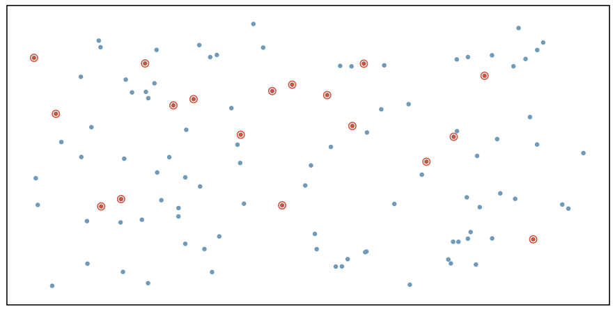
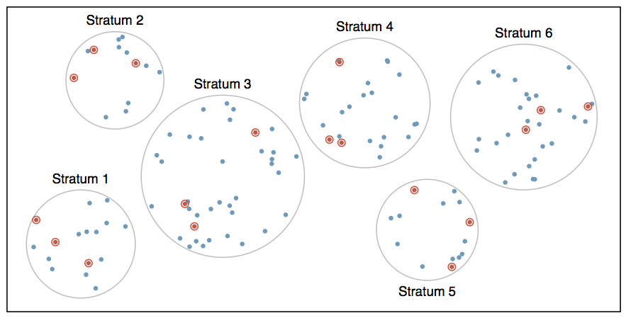
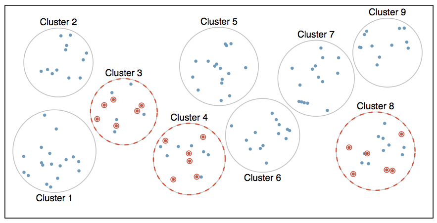
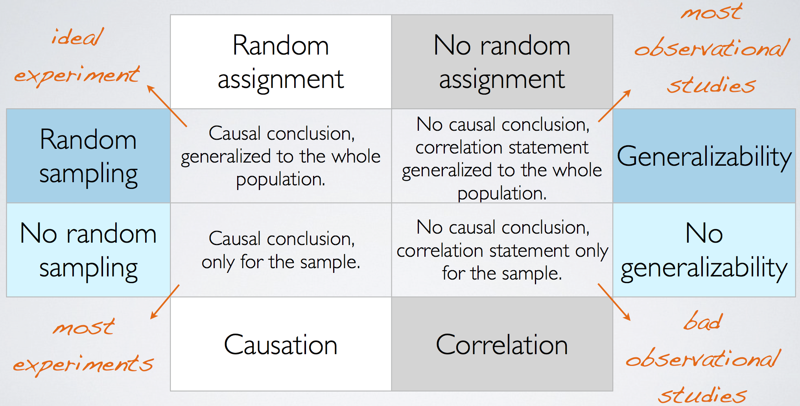
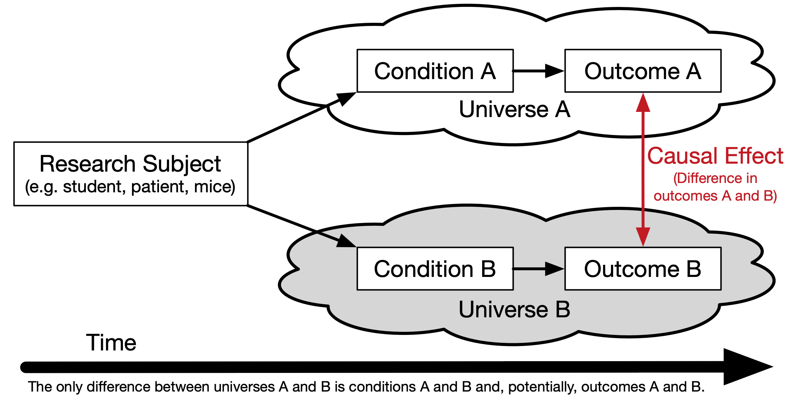

```{r setup, include = FALSE}
# Some slides are derivative of OpenIntro slides and licensed using CC BY-SA license.
# https://github.com/OpenIntroStat/openintro-statistics-slides

source('../config.R', local = TRUE)
library(brickset)
data(legosets)
```

class: center, middle, inverse, title-slide

# `r metadata$title`
## `r metadata$subtitle`
### `r metadata$author`
### `r metadata$date`


---
# Familiarity with Statistical Topics `r hexes(c('googlesheets4','likert'))`

```{r, echo = FALSE, cache = TRUE, message = FALSE, warning = FALSE}
library(googlesheets4)

results <- read_sheet('https://docs.google.com/spreadsheets/d/1hw5fxvTNYi8lt2JnyXPSOiWSpN0MKcji5nuC7THN2qM/edit#gid=465598735') %>% as.data.frame()
mass.items <- c('I find math interesting.',
				'I get uptight during math tests.',
				'I think that I will use math in the future.',
				'Mind goes blank and I am unable to think clearly when doing my math test.',
				'Math relates to my life.',
				'I worry about my ability to solve math problems.',
				'I get a sinking feeling when I try to do math problems.',
				'I find math challenging.',
				'Mathematics makes me feel nervous.',
				'I would like to take more math classes.',
				'Mathematics makes me feel uneasy.',
				'Math is one of my favorite subjects.',
				'I enjoy learning with mathematics.',
				'Mathematics makes me feel confused.')
mass.results <- results[,5:18]
for(i in 1:ncol(mass.results)) {
	mass.results[,i] <- factor(mass.results[,i],
						  levels = c('Strongly Disagree', 'Disagree', 'Neutral',
						  		   'Agree', 'Strongly Agree'),
						  ordered = TRUE)
}
names(mass.results) <- mass.items

stats.items <- c('Descriptive Statistics',
                 'Probability',
                 'Data visualizations',
				 'Correlation',
                 'Central limit theorem',
                 'Null hypothesis testing',
				 'ANOVA',
				 'Chi-squared tests',
				 'Type I and II errors',
                 'Assumptions for regression',
                 'Linear regression',
                 'Multiple regression',
				 'Logistic regression',
                 'Predictive modeling',
                 'SPSS',
                 'R',
                 'Python')

stats.results <- results[,19:35]
for(i in 1:ncol(stats.results)) {
	stats.results[,i] <- factor(stats.results[,i],
						  levels = c('Not at all familiar', 'Sligtly familiar',
						  		     'Somewhat familiar',
						  		     'Moderately familiar', 'Extremely familiar'),
						  ordered = TRUE)
}
names(stats.results) <- stats.items
```


```{r, fig.width=12, fig.align='center'}
likert(stats.results) %>% plot(center = 2.5)
```

---
# Math Anxiety Survey Scale `r hexes(c('googlesheets4','likert'))`

```{r, fig.width = 12, fig.align='center'}
likert(mass.results) %>% plot()
```


---
# Validity and Reliability

* An assessment is **valid** if it measures what it is supposed to measure.

* An assessment is **reliable** if it measures the same thing consistently and reproducibly. 

* Trusted assessments must be reliable AND valid.

<table border='0'><tr>
<td align='center'>
<br />Not reliable
</td><td align='center'>
<br />Reliable but not valid
</td><td align='center'>
<br />Reliable and valid
</td></tr></table>

.small[
More info: [Riezler, S., & Hagmann, M. (2021). Validity, Reliability, and Significance Empirical Methods for NLP and Data Science](https://www.cl.uni-heidelberg.de/statnlpgroup/empirical_methods/Riezler2021_EmpiricalMethods-draft.pdf)
]

---
# Case Study

**Treating Chronic Fatigue Syndrome**

* Objective: Evaluate the effectiveness of cognitive-behavior therapy for chronic fatigue syndrome.

* Participant pool: 142 patients who were recruited from referrals by primary care physicians and consultants to a hospital clinic specializing in chronic fatigue syndrome.

* Actual participants: Only 60 of the 142 referred patients entered the study. Some were excluded because they didn't meet the diagnostic criteria, some had other health issues, and some refused to be a part of the study.

.small[Source: Deale et. al. *Cognitive behavior therapy for chronic fatigue syndrome: A randomized controlled trial*. The American Journal of Psychiatry 154.3 (1997).]

---
# Study design

Patients randomly assigned to treatment and control groups, 30 patients in each group:

* **Treatment**: Cognitive behavior therapy -- collaborative, educative, and with a behavioral emphasis. Patients were shown on how activity could be increased steadily and safely without exacerbating symptoms.

* **Control**: Relaxation -- No advice was given about how activity could be increased. Instead progressive muscle relaxation, visualization, and rapid relaxation skills were taught.

---
# Results

The table below shows the distribution of patients with good outcomes at 6-month follow-up. Note that 7 patients dropped out of the study: 3 from the treatment and 4 from the control group.


|           | Yes   | No    |   Total     |
|:----------|:-----:|:-----:|:-----------:|
| Treatment | 19    | 8     | 27          |
| Control   | 5     | 21    | 26          |


* Proportion with good outcomes in treatment group:
$$19 / 27 \approx 0.70 \rightarrow 70\%$$


* Proportion with good outcomes in control group:
$$5 / 26 \approx 0.19 \rightarrow 19\%$$

---
# Understanding the results

**Do the data show a "real" difference between the groups?**

* Suppose you flip a coin 100 times. While the chance a coin lands heads in any given coin flip is 50%, we probably won't observe exactly 50 heads. This type of fluctuation is part of almost any type of data generating process.

* The observed difference between the two groups (70 - 19 = 51%) may be real, or may be due to natural variation.

* Since the difference is quite large, it is more believable that the difference is real.

* We need statistical tools to determine if the difference is so large that we should reject the notion that it was due to chance.

---
# Generalizing the results

**Are the results of this study generalizable to all patients with chronic fatigue syndrome?**

These patients had specific characteristics and volunteered to be a part of this study, therefore they may not be representative of all patients with chronic fatigue syndrome. While we cannot immediately generalize the results to all patients, this first study is encouraging. The method works for patients with some narrow set of characteristics, and that gives hope that it will work, at least to some degree, with other patients.


---
# Sampling vs. Census

A census involves collecting data for the entire population of interest. This is problematic for several reasons, including:

* It can be difficult to complete a census: there always seem to be some individuals who are hard to locate or hard to measure. And these difficult-to-find people may have certain characteristics that distinguish them from the rest of the population.

* Populations rarely stand still. Even if you could take a census, the population changes constantly, so it’s never possible to get a perfect measure.

* Taking a census may be more complex than sampling.

Sampling involves measuring a subset of the population of interest, usually randomly.


---
# Sampling Bias

* **Non-response**: If only a small fraction of the randomly sampled people choose to respond to a survey, the sample may no longer be representative of the population.

* **Voluntary response**: Occurs when the sample consists of people who volunteer to respond because they have strong opinions on the issue. Such a sample will also not be representative of the population.

* **Convenience sample**: Individuals who are easily accessible are more likely to be included in the sample.


---
# Simple Random Sampling

Randomly select cases from the population, where there is no implied connection between the points that are selected.

.center[]

---
# Stratified Sampling

*Strata* are made up of similar observations. We take a simple random sample from each stratum.

.center[]


---
# Cluster Sampling

*Clusters* are usually not made up of homogeneous observations so we take random samples from random samples of clusters.

.center[]

---
# Observational Studies vs. Experiments

* **Observational study**: Researchers collect data in a way that does not directly interfere with how the data arise, i.e. they merely “observe”, and can only establish an association between the explanatory and response variables.

* **Experiment**: Researchers randomly assign subjects to various treatments in order to establish causal connections between the explanatory and response variables.

<center><br /><font size='-2'>Source: [XKCD 552 http://xkcd.com/552/](http://xkcd.com/552/)</font></center>

<center><b><font size="+4">Correlation does not imply causation!</font></b></center>


---
# Principles of experimental design

1. **Control**: Compare treatment of interest to a control group.

2. **Randomize**: Randomly assign subjects to treatments, and
randomly sample from the population whenever possible.

3. **Replicate**: Within a study, replicate by collecting a sufficiently large sample. Or replicate the entire study.

4. **Block**: If there are variables that are known or suspected to affect the response variable, first group subjects into blocks based on these variables, and then randomize cases within each block to treatment groups.

Difference between blocking and explanatory variables
* Factors are conditions we can impose on the experimental units.
* Blocking variables are characteristics that the experimental units come with, that we would like to control for.
* Blocking is like stratifying, except used in experimental settings when randomly assigning, as opposed to when sampling.


---
# More experimental design terminology...

* **Placebo**: fake treatment, often used as the control group for medical studies

* **Placebo effect**: experimental units showing improvement simply because they believe they are receiving a special treatment

* **Blinding**: when experimental units do not know whether they are in the control or treatment group

* **Double-blind**: when both the experimental units and the researchers who interact with the patients do not know who is in the control and who is in the treatment group


---
# Random assignment vs. random sampling

.center[



]

---
# Causality

.center[



]

---
# Randomized Control Trials

.pull-left[

```{r, echo=FALSE, message=FALSE, warning=FALSE, fig.align='center'}
library(psych)
library(purrr)

pop.mean <- 100
pop.sd <- 15
pop.es <- .3

n <- 30

set.seed(2112)
thedata <- data.frame(
	id = 1:30,
	center = rnorm(n, mean = pop.mean, sd = pop.sd),
	stringsAsFactors = FALSE
)
val <- pop.sd * pop.es / 2
thedata$placebo <- thedata$center - val
thedata$treatment <- thedata$center + val
thedata$diff <- thedata$treatment - thedata$placebo
thedata$RCT_Assignment <- sample(c('placebo', 'treatment'), n, replace = TRUE)
thedata$RCT_Value <- as.numeric(apply(thedata, 1, 
					FUN = function(x) { return(x[x['RCT_Assignment']]) }))
tab.out <- describeBy(thedata$RCT_Value, group = thedata$RCT_Assignment, mat = TRUE, skew = FALSE)
```

```{r, echo=FALSE, message=FALSE, warning=FALSE, fig.align='center', fig.height=10}
ggplot(thedata) + 
	geom_segment(aes(x = placebo, xend = treatment, y = id, yend = id)) +
	geom_point(aes(x = placebo, y = id), color = 'blue') +
	geom_point(aes(x = treatment, y = id), color = 'red') +
	ylab('') + xlab('Outcome') +
	xlim(pop.mean - 3 * pop.sd, pop.mean + 3 * pop.sd) +
	ggtitle(paste0('True Counterfactual Difference = ', mean(thedata$diff)))
```

]

.pull-right[

]

---
# Randomized Control Trials

.pull-left[

```{r, echo=FALSE, message=FALSE, warning=FALSE, fig.align='center', fig.height=10}
ggplot(thedata) + 
	geom_segment(aes(x = placebo, xend = treatment, y = id, yend = id)) +
	geom_point(aes(x = placebo, y = id), color = 'blue') +
	geom_point(aes(x = treatment, y = id), color = 'red') +
	ylab('') + xlab('Outcome') +
	xlim(pop.mean - 3 * pop.sd, pop.mean + 3 * pop.sd) +
	ggtitle(paste0('True Counterfactual Difference = ', mean(thedata$diff)))
```

]

.pull-right[

```{r echo=FALSE, message=FALSE, warning=FALSE, fig.align='center', fig.height=10}
ggplot(thedata, aes(x = RCT_Value, color = RCT_Assignment, y = id)) +
	geom_point() +
	scale_color_manual(values = c('placebo' = 'blue', 'treatment' = 'red')) +
	theme(legend.position = 'none') +
	geom_vline(data = tab.out, aes(xintercept = mean, color = group1)) +
	ylab('') + xlab('Outcome') +
	xlim(pop.mean - 3 * pop.sd, pop.mean + 3 * pop.sd) +
	ggtitle(paste0('RCT Difference = ', round(diff(tab.out$mean), digits = 2)))
```

]

---
# What if we take a lot of random samples?

.code80[
```{r, fig.width=10, fig.height=3.5, fig.align = 'center'}
mean_differences <- numeric(500)
for(i in 1:length(mean_differences)) {
	thedata$RCT_Assignment <- sample(c('placebo', 'treatment'), nrow(thedata), replace = TRUE)
	thedata$RCT_Value <- as.numeric(apply(thedata, 1, 
					FUN = function(x) { return(x[x['RCT_Assignment']]) }))
	tab.out <- describeBy(thedata$RCT_Value, group = thedata$RCT_Assignment, mat = TRUE, skew = FALSE)
	mean_differences[i] <- diff(tab.out$mean)
}
ggplot() + geom_histogram(aes(x = mean_differences), bins = 20, fill = 'grey70') + 
	geom_vline(xintercept = mean(mean_differences), color = 'red', alpha = 0.5) +
	geom_vline(xintercept = pop.sd * pop.es, color = 'blue', alpha = 0.5)
```
]

---
class: inverse, middle, center
# Data Visualization

---
class: middle
# Grammer of Graphics

.center[

]

---
# Data Visualizations with ggplot2 `r hexes(c('ggplot2'))`

* `ggplot2` is an R package that provides an alternative framework based upon Wilkinson’s (2005) Grammar of Graphics.

* `ggplot2` is, in general, more flexible for creating "prettier" and complex plots.

* Works by creating layers of different types of objects/geometries (i.e. bars, points, lines, polygons, etc.)
`ggplot2` has at least three ways of creating plots:
     1. `qplot`
     2. `ggplot(...) + geom_XXX(...) + ...`
     3. `ggplot(...) + layer(...)`

* We will focus only on the second.


---
# Parts of a `ggplot2` Statement `r hexes(c('ggplot2'))`

* Data  
`ggplot(myDataFrame, aes(x=x, y=y))`

* Layers  
`geom_point()`, `geom_histogram()`

* Facets  
`facet_wrap(~ cut)`, `facet_grid(~ cut)`

* Scales  
`scale_y_log10()`

* Other options  
`ggtitle('my title')`, `ylim(c(0, 10000))`, `xlab('x-axis label')`

---
# Lots of geoms `r hexes(c('ggplot2'))`

```{r}
ls('package:ggplot2')[grep('^geom_', ls('package:ggplot2'))]
```

---
# Data Visualization Cheat Sheet `r hexes(c('ggplot2'))`

.center[
<a href='https://github.com/rstudio/cheatsheets/raw/master/data-visualization-2.1.pdf'></a>
]


---
# Scatterplot  `r hexes(c('ggplot2'))`

```{r, warning=FALSE}
ggplot(legosets, aes(x=pieces, y=US_retailPrice)) + geom_point()
```

---
# Scatterplot (cont.)  `r hexes(c('ggplot2'))`

```{r, warning=FALSE}
ggplot(legosets, aes(x=pieces, y=US_retailPrice, color=availability)) + geom_point()
```

---
# Scatterplot (cont.)  `r hexes(c('ggplot2'))`

```{r, warning=FALSE}
ggplot(legosets, aes(x=pieces, y=US_retailPrice, size=minifigs, color=availability)) + geom_point()
```

---
# Scatterplot (cont.)  `r hexes(c('ggplot2'))`

```{r, warning=FALSE}
ggplot(legosets, aes(x=pieces, y=US_retailPrice, size=minifigs)) + geom_point() + facet_wrap(~ availability)
```

---
# Boxplots  `r hexes(c('ggplot2'))`

```{r, warning=FALSE}
ggplot(legosets, aes(x='Lego', y=US_retailPrice)) + geom_boxplot()
```

---
# Boxplots (cont.)  `r hexes(c('ggplot2'))`

```{r, warning=FALSE}
ggplot(legosets, aes(x=availability, y=US_retailPrice)) + geom_boxplot()
```

---
# Boxplot (cont.)  `r hexes(c('ggplot2'))`

```{r, warning=FALSE}
ggplot(legosets, aes(x=availability, y=US_retailPrice)) + geom_boxplot() + coord_flip()
```

---
# Histograms `r hexes(c('ggplot2'))`

```{r}
ggplot(legosets, aes(x = US_retailPrice)) + geom_histogram()
```

---
# Histograms (cont.)`r hexes(c('ggplot2'))`

```{r}
ggplot(legosets, aes(x = US_retailPrice)) + geom_histogram() + scale_x_log10()
```

---
# Histograms (cont.) `r hexes(c('ggplot2'))`

```{r}
ggplot(legosets, aes(x = US_retailPrice)) + geom_histogram() + facet_wrap(~ availability)
```

---
# Density Plots `r hexes(c('ggplot2'))`

```{r}
ggplot(legosets, aes(x = US_retailPrice, color = availability)) + geom_density()
```

---
# `ggplot2` aesthetics `r hexes(c('ggplot2'))`

.center[
<a href='images/ggplot_aesthetics_cheatsheet.png' target='_new'> </a>
]

---
# Likert Scales `r hexes(c('likert'))`

Likert scales are a type of questionnaire where respondents are asked to rate items on scales usually ranging from four to seven levels (e.g. strongly disagree to strongly agree).

```{r, message=FALSE, warning=FALSE}
library(likert)
library(reshape)
data(pisaitems)
items24 <- pisaitems[,substr(names(pisaitems), 1,5) == 'ST24Q']
items24 <- rename(items24, c(
			ST24Q01="I read only if I have to.",
			ST24Q02="Reading is one of my favorite hobbies.",
			ST24Q03="I like talking about books with other people.",
			ST24Q04="I find it hard to finish books.",
			ST24Q05="I feel happy if I receive a book as a present.",
			ST24Q06="For me, reading is a waste of time.",
			ST24Q07="I enjoy going to a bookstore or a library.",
			ST24Q08="I read only to get information that I need.",
			ST24Q09="I cannot sit still and read for more than a few minutes.",
			ST24Q10="I like to express my opinions about books I have read.",
			ST24Q11="I like to exchange books with my friends."))

```

---
# `likert` R Package `r hexes(c('likert'))`

```{r}
l24 <- likert(items24)
summary(l24)
```

---
# `likert` Plots  `r hexes(c('likert'))`

```{r, fig.width=8}
plot(l24)
```

---
# `likert` Plots  `r hexes(c('likert'))`

```{r, fig.width=8}
plot(l24, type='heat')
```

---
# `likert` Plots  `r hexes(c('likert'))`

```{r, fig.width=4, fig.height=7}
plot(l24, type='density')
```


---
# Pie Charts

There is only one pie chart in *OpenIntro Statistics* (Diez, Barr, & Çetinkaya-Rundel, 2015, p. 48). Consider the following three pie charts that represent the preference of five different colors. Is there a difference between the three pie charts? This is probably a difficult to answer.

<center></center>


---
# Pie Charts

There is only one pie chart in *OpenIntro Statistics* (Diez, Barr, & Çetinkaya-Rundel, 2015, p. 48). Consider the following three pie charts that represent the preference of five different colors. Is there a difference between the three pie charts? This is probably a difficult to answer.

<center></center>

<center></center>

Source: [https://en.wikipedia.org/wiki/Pie_chart](https://en.wikipedia.org/wiki/Pie_chart).

---
class: middle
# Just say NO to pie charts!

.font150[
"There is no data that can be displayed in a pie chart that cannot better be displayed in some other type of chart"]
.right[.font130[John Tukey]]

---
# Additional Resources

For data wrangling:

* `dplyr` website: https://dplyr.tidyverse.org
* R for Data Science book: https://r4ds.had.co.nz/wrangle-intro.html
* Wrangling penguins tutorial: https://allisonhorst.shinyapps.io/dplyr-learnr/#section-welcome
* Data transformation cheat sheet: https://github.com/rstudio/cheatsheets/raw/master/data-transformation.pdf

For data visualization:

* `ggplot2` website: https://ggplot2.tidyverse.org
* R for Data Science book: https://r4ds.had.co.nz/data-visualisation.html
* R Graphics Cookbook: https://r-graphics.org
* Data visualization cheat sheet: https://github.com/rstudio/cheatsheets/raw/master/data-visualization-2.1.pdf


---
# One Minute Paper

.pull-left[
Complete the one minute paper: `r one_minute_paper`

1. What was the most important thing you learned during this class?

2. What important question remains unanswered for you?
]
.pull-right[

]
