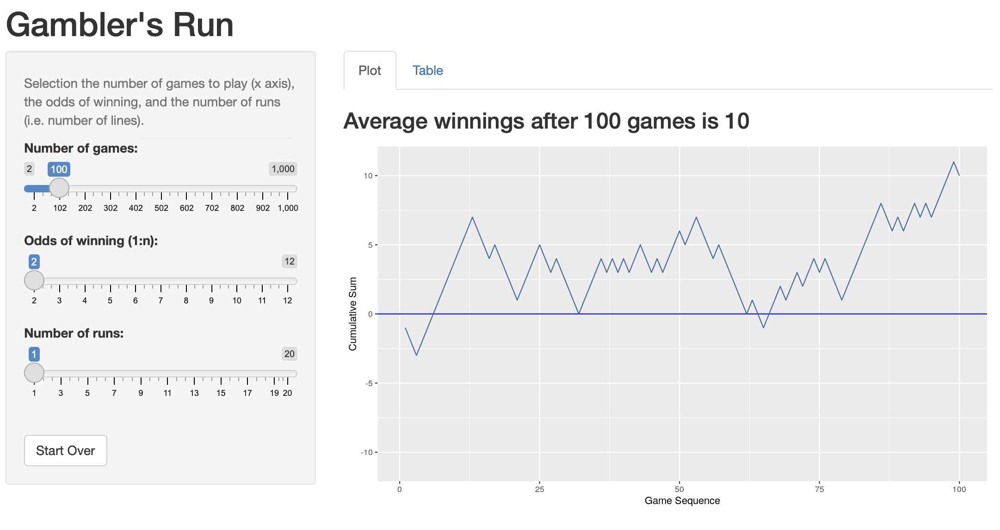
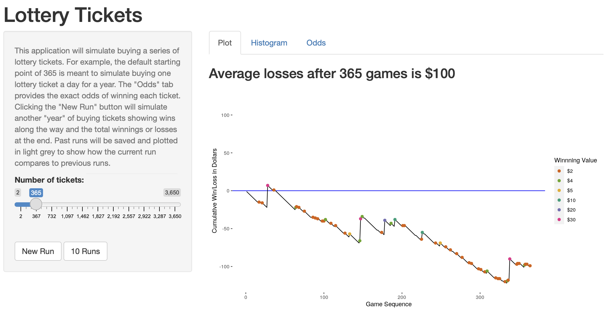
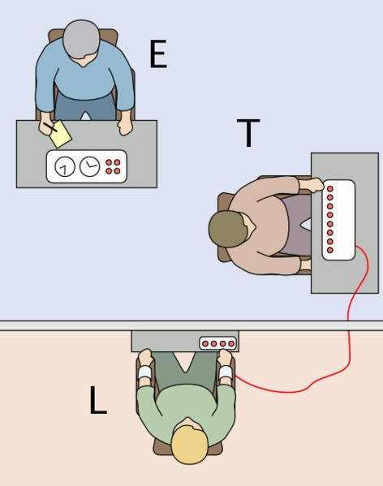
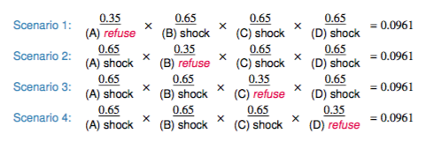

```{r setup, include = FALSE}
# Cartoons from https://github.com/allisonhorst/stats-illustrations
# dplyr based upon https://allisonhorst.shinyapps.io/dplyr-learnr/#section-welcome

source('../config.R')
```

class: center, middle, inverse, title-slide

# `r metadata$title`
## `r metadata$subtitle`
### `r metadata$author`
### `r metadata$date`

---
# One Minute Paper Results

```{r, echo=FALSE}
library(googlesheets4)
omp <- read_sheet(one_minute_paper_results)
# names(omp)[8] <- 'Time_Spent'
# omp$Time_Spent <- NULL
# omp$Time_Spent <- sapply(omp$Time_Spent, FUN = function(x) { x[[1]] })
omp <- omp %>% filter(`Class Date` == 'January 23')
```

.pull-left[
**What was the most important thing you learned during this class?**
```{r, echo=FALSE, fig.height=9}
ompWordCloud(omp$`What was the most important thing you learned during this class?`)
```
]
.pull-right[
**What important question remains unanswered for you?**
```{r, echo=FALSE, fig.height=9}
ompWordCloud(omp$`What important question remains unanswered for you?`)
```
]


---
# Probability

There are two key properties of probability models:

1. P(A) = The probability of event A
2. $0 \le P(A) \le 1$

This semester we will examine two interpretations of probabilty:

* **Frequentist interpretation**: The probability of an outcome is the proportion of times the outcome would occur if we observed the random process an infinite number of times.

* **Bayesian interpretation**: A Bayesian interprets probability as a subjective degree of belief: For the same event, two separate people could have different viewpoints and so assign different probabilities. Largely popularized by revolutionary advance in computational technology and methods during the last twenty years.

---
# Law of Large Numbers

Law of large numbers states that as more observations are collected, the proportion of occurrences with a particular outcome, ${\hat{p}}_n$, converges to the probability of that outcome, $p$.

--

When tossing a fair coin, if heads comes up on each of the first 10 tosses, what do you think the chance is that another head will come up on the next coin toss? 0.5, less 0.5, or greater 0.5?

--

When tossing a fair coin, if heads comes up on each of the first 10 tosses, what do you think the chance is that another head will come up on the next coin toss? 0.5, less 0.5, or greater 0.5?

* The probability is still 0.5, or there is still a 50% chance that another head will come up on the next toss.
* The coin is not "due"" for a tail.
* The common misunderstanding of the LLN is that random processes are supposed to compensate for whatever happened in the past; this is just not true and is also called **gambler’s fallacy** (or **law of averages**).

---
# Coin Toss Demo

```{r, eval=FALSE}
library(DATA606)
shiny_demo('gambler')
```

.center[

<a href='https://r.bryer.org/shiny/gambler/' target='_new'></a>

]

---
# Coin Tosses

```{r}
coins <- sample(c(-1,1), 1000, replace=TRUE)
plot(1:length(coins), cumsum(coins), type='l')
abline(h=0)
```

---
# Coin Tosses (Full Range) 

```{r}
plot(1:length(coins), cumsum(coins), type='l', ylim=c(-1000, 1000))
abline(h=0)
```

---
# Disjoint and non-disjoint outcomes

**Disjoint** (mutually exclusive) outcomes: Cannot happen at the same time.

* The outcome of a single coin toss cannot be a head and a tail. A student both cannot fail and pass a class.
* A single card drawn from a deck cannot be an ace and a queen.

**Non-disjoint** outcomes: Can happen at the same time.

* A student can get an A in Stats and A in Econ in the same semester.

---
# Probability Distributions

A probability distribution lists all possible events and the probabilities with which they occur.

* The probability distribution for the a coin toss:

Event      | Heads | Tails
-----------|-------|---------
Probability | 0.5   | 0.5

Rules for probability distributions: 

1. The events listed must be disjoint
2. Each probability must be between 0 and 1 
3. The probabilities must total 1

---
# Probabilty Distrubtions (cont.)

The probability distribution for two coin tosses:

Event       | HH   | TT   | HT   | TH
------------|------|------|------|------
Probability | 0.25 | 0.25 | 0.25 | 0.25

---
# Independence

Two processes are independent if knowing the outcome of one provides no useful information about the outcome of the other.

* Knowing that the coin landed on a head on the first toss does not provide any useful information for determining what the coin will land on in the second toss. → Outcomes of two tosses of a coin are independent.

* Knowing that the first card drawn from a deck is an ace does provide useful information for determining the probability of drawing an ace in the second draw. → Outcomes of two draws from a deck of cards (without replacement) are dependent.


---
# Checking for Independence

If P(A occurs, given that B is true) = P(A | B) = P(A), then A and B are independent.

* P(protects citizens) = 0.58
* P(randomly selected NC resident says gun ownership protects citizens, given that the resident is white) = P(protects citizens | White) = 0.67
* P(protects citizens | Black) = 0.28
* P(protects citizens | Hispanic) = 0.64

P(protects citizens) varies by race/ethnicity, therefore opinion on gun ownership and race ethnicity are most likely dependent.

---
# Random Variables

A random variable is a numeric quantity whose value depends on the outcome of a random event

* We use a capital letter, like X, to denote a random variable
* The values of a random variable are denoted with a lowercase letter, in this case x
* For example, P(X = x)

There are two types of random variables:

* **Discrete random variables** often take only integer values  
Example: Number of credit hours, Difference in number of credit hours this term vs last

* **Continuous random variables** take real (decimal) values  
Example: Cost of books this term, Difference in cost of books this term vs last

---
# Lottery

```{r, eval=FALSE}
library(DATA606)
shiny_demo('lottery')
```

.center[

<a href='https://r.bryer.org/shiny/lottery/' target='_new'></a>

]


---
# Expectation

* We are often interested in the average outcome of a random variable.
* We call this the expected value (mean), and it is a weighted average of the possible outcomes

$$\mu =E(X)=\sum^{k}_{i=1} x_{i}P(X=x_{i})$$

---
# Expected value of a discrete random variable

In a game of cards you win $1 if you draw a heart, $5 if you draw an ace (including the ace of hearts), $10 if you draw the king of spades and nothing for any other card you draw. Write the probability model for your winnings, and calculate your expected winning.

Event           | X  | P(X)  | X P(X)
----------------|----|-------|--------
Heart (not Ace) | 1  | 12/52 | 12/52
Ace             | 5  |  4/52 | 20/52
King of Spades  | 10 |  1/52 | 10/52
All else        | 0  | 35/52 | 0
Total           |    |       | $E(X) = \frac{42}{52} \approx 0.81$

---
# Expected value of a discrete random variable

```{r, fig.width=10, fig.height=5}
cards <- data.frame(Event = c('Heart (not ace)','Ace','King of Spades','All else'),
	X = c(1, 5, 10, 0),	pX = c(12/52, 5/52, 1/52, 32/52) )
cards$XpX <- cards$X * cards$pX
cards2 <- rep(0, 11)
cards2[cards$X + 1] <- cards$pX
names(cards2) <- 0:10
barplot(cards2, main='Probability of Winning Game')
```

---
# Estimating Expected Values with Simulations

```{r}
tickets <- as.data.frame(rbind(
	c(    '$1',    1,     15),
	c(    '$2',    2,     11),
	c(    '$4',    4,     62),
	c(    '$5',    5,    100),
	c(   '$10',   10,    143),
	c(   '$20',   20,    250),
	c(   '$30',   30,    562),
	c(   '$50',   50,   3482),
	c(  '$100',  100,   6681),
	c(  '$500',  500,  49440),
	c('$1500',  1500, 375214),
	c('$2500',  2500, 618000)
), stringsAsFactors=FALSE)
names(tickets) <- c('Winnings', 'Value', 'Odds')
tickets$Value <- as.integer(tickets$Value)
tickets$Odds <- as.integer(tickets$Odds)
```

---
# Estimating Expected Values with Simulations

.pull-left[

```{r, fig.width=8, fig.height=3}
m <- 618000 * 375214 # A multiple of all odds
odds <- sample(m, 1000, replace=TRUE)
vals <- rep(-1, length(odds))
for(i in 1:nrow(tickets)) {
	vals[odds %% tickets[i,'Odds'] == 0] <- 
		tickets[i,'Value'] - 1 
}
head(vals, n=10)
mean(vals)
```
]
.pull-right[
```{r, fig.width=6, fig.height=6}
ggplot(data.frame(Winnings=vals), aes(x=Winnings)) + 
	geom_bar(binwidth=1)
```
]


---
# Expected Value of Lottery Example

$$\mu =E(X)=\sum^{k}_{i=1} x_{i}P(X=x_{i})$$

```{r, echo=FALSE}
tickets <- as.data.frame(rbind(
	c(    '$1',    1,     15),
	c(    '$2',    2,     11),
	c(    '$4',    4,     62),
	c(    '$5',    5,    100),
	c(   '$10',   10,    143),
	c(   '$20',   20,    250),
	c(   '$30',   30,    562),
	c(   '$50',   50,   3482),
	c(  '$100',  100,   6681),
	c(  '$500',  500,  49440),
	c('$1500',  1500, 375214),
	c('$2500',  2500, 618000)
), stringsAsFactors=FALSE)
names(tickets) <- c('Winnings', 'Value', 'Odds')
tickets$Value <- as.integer(tickets$Value)
tickets$Odds <- as.integer(tickets$Odds)

tickets$xPx <- tickets$Value * (1 / tickets$Odds)
```

.pull-left[
```{r}
tickets
```
]
.pull-right[
Expected value for one ticket
```{r}
sum(tickets$xPx) - 1 
```
]

---
# Expected Value of Lottery Example (cont)

```{r}
sum(tickets$xPx) - 1 # Expected value for one ticket
```

Simulated

```{r}
nGames <- 1
runs <- numeric(10000)
for(j in seq_along(runs)) {
	odds <- sample(max(tickets$Odds), nGames, replace = TRUE)
	vals <- rep(-1, length(odds))
	for(i in 1:nrow(tickets)) {
		vals[odds %% tickets[i,'Odds'] == 0] <- tickets[i,'Value'] - 1
	}
	runs[j] <- cumsum(vals)[nGames]
}
mean(runs)
```

---
# Note on Randomization in R

We will use many different functions throughout the course to randomly generate data. The first is the `sample` function. This function simply randomly samples from the first parameter. Consider the `letters` vector containing the 26 letters of the alphabet. Calling `sample` with just that vector will shuffle the vector.

```{r}
letters
sample(letters)
```

---
#  Note on Randomization in R  (cont.)

You can specify how many you want to return with the `size` parameter.

```{r}
sample(letters, size = 1)
```

The `replace` will ensure that each randomly selected value is independent of the others.

```{r}
sample(letters, size = 30, replace = TRUE)
```

---
# Coins Example

```{r}
coin <- c('H', 'T')
sample(coin)
sample(coin, 1)
sample(coin, 100, replace = TRUE)
```

---
# Seeds

Computers are generally not good at randomizaiton. Instead, R (and really all programs) uses a [pseudo random algorithm](https://en.wikipedia.org/wiki/Pseudorandomness). These algorithms rely on a seed, or starting point for the algorithm. You can set the seed to ensure that your analysis is reproducible. For example, setting the seed below before calling `sample` will ensure we get the same answer.

```{r}
set.seed(2112); sample(100, 1)
set.seed(2112); sample(100, 1)
```

---
# Is it really random?

```{r}
df <- data.frame(x = 1:1000, y = NA_integer_)
for(i in 1:nrow(df)) {
	set.seed(i)
	df[i,]$y <- sample(100, 1)
}
```

.pull-left[
```{r}
ggplot(df, aes(x = x, y = y)) + geom_point()
```
]

.pull-right[
```{r}
cor.test(df$x, df$y)
```
]

---
class: inverse, middle, center
# Distributions


---
# Coin Tosses Revisited 

```{r}
coins <- sample(c(-1,1), 100, replace=TRUE)
plot(1:length(coins), cumsum(coins), type='l')
abline(h=0)
cumsum(coins)[length(coins)]
```

---
class: font120
# Many Random Samples

```{r}
samples <- rep(NA, 1000)
for(i in seq_along(samples)) {
	coins <- sample(c(-1,1), 100, replace=TRUE)
	samples[i] <- cumsum(coins)[length(coins)]
}
head(samples, n = 15)
```

---
# Histogram of Many Random Samples 

```{r}
hist(samples)
```

---
# Properties of Distribution 

```{r}
(m.sam <- mean(samples))
(s.sam <- sd(samples))
```

---
# Properties of Distribution (cont.)

```{r}
within1sd <- samples[samples >= m.sam - s.sam & samples <= m.sam + s.sam]
length(within1sd) / length(samples)
within2sd <- samples[samples >= m.sam - 2 * s.sam & samples <= m.sam + 2* s.sam]
length(within2sd) / length(samples)
within3sd <- samples[samples >= m.sam - 3 * s.sam & samples <= m.sam + 3 * s.sam]
length(within3sd) / length(samples)
```


---
# Standard Normal Distribution 

$$f\left( x|\mu ,\sigma  \right) =\frac { 1 }{ \sigma \sqrt { 2\pi  }  } { e }^{ -\frac { { \left( x-\mu  \right)  }^{ 2 } }{ { 2\sigma  }^{ 2 } }  }$$

```{r, fig.width=10, fig.height=5}
x <- seq(-4,4,length=200); y <- dnorm(x,mean=0, sd=1)
plot(x, y, type = "l", lwd = 2, xlim = c(-3.5,3.5), ylab='', xlab='z-score', yaxt='n')
```

---
# Standard Normal Distribution 

```{r, echo=FALSE}
x <- seq(-4,4,length=200)
y <- dnorm(x,mean=0, sd=1)
plot(x, y, type = "l", lwd = 2, xlim = c(-3.5,3.5), ylab='', xlab='z-score', yaxt='n')
lb <- -1; ub <- 1
i <- x >= lb & x <= ub
polygon(c(lb,x[i],ub), c(0,y[i],0), col="grey90") 
text(0, .1, "68%")
```

---
# Standard Normal Distribution 

```{r, echo=FALSE}
x <- seq(-4,4,length=200)
y <- dnorm(x,mean=0, sd=1)
plot(x, y, type = "l", lwd = 2, xlim = c(-3.5,3.5), ylab='', xlab='z-score', yaxt='n')
lb <- -2; ub <- 2
i <- x >= lb & x <= ub
polygon(c(lb,x[i],ub), c(0,y[i],0), col="grey90") 
text(0, .1, "95%")
```

---
# Standard Normal Distribution 

```{r, echo=FALSE}
x <- seq(-4,4,length=200)
y <- dnorm(x,mean=0, sd=1)
plot(x, y, type = "l", lwd = 2, xlim = c(-3.5,3.5), ylab='', xlab='z-score', yaxt='n')
lb <- -3; ub <- 3
i <- x >= lb & x <= ub
polygon(c(lb,x[i],ub), c(0,y[i],0), col="grey90") 
text(0, .1, "99.7%")
```

---
# What's the likelihood of ending with less than 15? 

```{r}
pnorm(15, mean=mean(samples), sd=sd(samples))
```

```{r, echo=FALSE, fig.width=8, fig.height=4, echo=FALSE}
x <- seq(-4,4,length=200)
y <- dnorm(x,mean=0, sd=1)
plot(x, y, type = "l", lwd = 2, xlim = c(-3.5,3.5), ylab='', xlab='z-score', yaxt='n')
lb <- min(x); ub <- (15 - mean(samples)) / sd(samples)
i <- x >= lb & x <= ub
polygon(c(lb,x[i],ub), c(0,y[i],0), col="grey90") 
```

---
# What's the likelihood of ending with more than 15? 

```{r}
1 - pnorm(15, mean=mean(samples), sd=sd(samples))
```

```{r, echo=FALSE, fig.width=8, fig.height=4, echo=FALSE}
x <- seq(-4,4,length=200)
y <- dnorm(x,mean=0, sd=1)
plot(x, y, type = "l", lwd = 2, xlim = c(-3.5,3.5), ylab='', xlab='z-score', yaxt='n')
ub <- max(x); lb <- (15 - mean(samples)) / sd(samples)
i <- x >= lb & x <= ub
polygon(c(lb,x[i],ub), c(0,y[i],0), col="grey90") 
```

---
# Comparing Scores on Different Scales

SAT scores are distributed nearly normally with mean 1500 and standard deviation 300. ACT scores are distributed nearly normally with mean 21 and standard deviation 5. A college admissions officer wants to determine which of the two applicants scored better on their standardized test with respect to the other test takers: Pam, who earned an 1800 on her SAT, or Jim, who scored a 24 on his ACT?

--

.pull-left[

### Z-Scores

* Z-scores are often called standard scores:

$$ Z = \frac{observation - mean}{SD} $$

* Z-Scores have a mean = 0 and standard deviation = 1.
 ]
 
--

.pull-right[
Converting Pam and Jim's scores to z-scores:

$$ Z_{Pam} = \frac{1800 - 1500}{300} = 1 $$

$$ Z_{Jim} = \frac{24-21}{5} = 0.6 $$
]


---
class: font90
# Dual Scales `r hexes(c('shiny'))`

Some problems<sup>1</sup>:

* The designer has to make choices about scales and this can have a big impact on the viewer
* "Cross-over points” where one series cross another are results of the design choices, not intrinsic to the data, and viewers (particularly unsophisticated viewers)
* They make it easier to lazily associate correlation with causation, not taking into account autocorrelation and other time-series issues
* Because of the issues above, in malicious hands they make it possible to deliberately mislead

This example looks at the relationship between NZ dollar exchange rate and trade weighted index.

```{r, eval=FALSE}
DATA606::shiny_demo('DualScales', package='DATA606')
```

My advise:

* Avoid using them. You can usually do better with other plot types.
* When necessary (or compelled) to use them, rescale (using z-scores, we'll discuss this in a few weeks)

.font50[
<sup>1</sup> http://blog.revolutionanalytics.com/2016/08/dual-axis-time-series.html  
<sup>2</sup> http://ellisp.github.io/blog/2016/08/18/dualaxes
]


---
# Standard Normal Parameters 

```{r, echo=FALSE, fig.width=10, fig.height=4}
par.orig <- par(mfrow=c(1,2), mar=c(2,1,1.5,1))
x <- seq(-4,4,length=200)
y <- dnorm(x,mean=0, sd=1)
plot(x, y, type = "l", lwd = 2, ylab='', xlab='', yaxt='n', col='green',
	 main=expression(paste(plain("N("), mu, plain(" = 0, "), sigma, plain(" = 1)"))))
x <- seq(5,33,length=200)
y <- dnorm(x,mean=19, sd=4)
plot(x, y, type = "l", lwd = 2, ylab='', xlab='', yaxt='n', col='blue',
	 main=expression(paste(plain("N("), mu, plain(" = 19, "), sigma, plain(" = 4)"))))
par(par.orig)

x <- seq(-4,30,length=200)
y <- dnorm(x,mean=0, sd=1)
plot(x, y, type = "l", lwd = 2, xlim = c(-3.5,30), ylab='', xlab='', yaxt='n', col='green')
x <- seq(-4,30,length=200)
y <- dnorm(x,mean=19, sd=4)
lines(x, y, type = "l", lwd = 2, xlim = c(-3.5,30), ylab='', xlab='', yaxt='n', col='blue')
```

---
# SAT Variability

SAT scores are distributed nearly normally with mean 1500 and standard deviation 300.

* 68% of students score between 1200 and 1800 on the SAT. 

* 95% of students score between 900 and 2100 on the SAT.

* 99.7% of students score between 600 and 2400 on the SAT.

---
# Evaluating Normal Approximation 

```{r, echo=FALSE, results='hide'}
heights <- c(180.34, 170.18, 175.26, 177.8, 172.72, 160.02, 172.72, 182.88, 177.8, 177.8, 167.64, 180.34, 180.34, 172.72, 165.1, 154.94, 180.34, 172.72, 165.1, 167.64, 182.88, 175.26, 182.88, 177.8, 175.26, 185.42, 175.26, 167.64, 187.96, 175.26, 180.34, 175.26, 198.12, 177.8, 185.42, 175.26, 180.34, 187.96, 182.88, 187.96, 177.8, 182.88, 187.96, 170.18, 182.88, 182.88, 175.26, 170.18, 182.88, 180.34, 180.34, 170.18, 180.34, 187.96, 193.04, 175.26, 193.04, 182.88, 177.8, 167.64, 170.18, 160.02, 172.72, 193.04, 187.96, 190.5, 172.72, 175.26, 193.04, 180.34, 162.56, 187.96, 182.88, 180.34, 177.8, 172.72, 185.42, 180.34, 180.34, 182.88, 185.42, 180.34, 195.58, 185.42, 170.18, 170.18, 172.72, 180.34, 190.5, 172.72, 182.88, 170.18, 177.8, 175.26, 162.56, 162.56, 175.26, 167.64, 170.18, 177.8)/2.54
```

To use the 68-95-99 rule, we must verify the normality assumption. We will want to do this also later when we talk about various (parametric) modeling. Consider a sample of `r length(heights)` male heights (in inches).

```{r, echo=FALSE, fig.height=6}
hist(heights, main=paste0('Male Heights (mean = ', round(mean(heights), digits=1), ', sd = ', round(sd(heights), digits=2), ')'))
```


---
# Evaluating Normal Approximation 

Histogram looks normal, but we can overlay a standard normal curve to help evaluation.

```{r, echo=FALSE, fig.height=6}
h <- hist(heights, xlim=c(60, 80))
x <- seq(min(heights)-5, max(heights)+5, 0.01)
y <- dnorm(x, mean(heights), sd(heights))
y <- y * diff(h$mids[1:2]) * length(heights)
lines(x, y, lwd=1.5, col='blue')
```

---
# Normal Q-Q Plot 

.pull-left[

```{r, echo=FALSE, fig.width=7, fig.height=7}
qqnorm(heights, cex=0.5, main='', axes=F, ylab='Male heights (in)', pch=19)
axis(1)
axis(2)
abline(mean(heights), sd(heights), col="blue", lwd=1.5)
```

]

.pull-right[.font120[

* Data are plotted on the y-axis of a normal probability plot, and theoretical quantiles (following a normal distribution) on the x-axis.
* If there is a linear relationship in the plot, then the data follow a nearly normal distribution.
* Constructing a normal probability plot requires calculating percentiles and corresponding z-scores for each observation, which is tedious. Therefore we generally rely on software when making these plots.

]]

---
# Skewness 

```{r, echo=FALSE}
set.seed(2112)
rs <- rgamma(100,1)
ls <- rbeta(100,3,0.5)

temp <- sort(rnorm(100))

st <- c(temp[16:85], rnorm(30,0,0.1))
lt <- c(temp[1:20]-rgamma(20,1), temp[21:80], temp[81:100]+rev(rgamma(20,1)))

par.orig <- par(mfrow=c(2,2), mgp=c(2,.7,0), mar=c(1,1,1,1))
qqnorm(rs, axes=F, xlab="", ylab="", pch=19, main="Right Skewed")
qqline(rs, col='blue')
qqnorm(ls, axes=F, xlab="", ylab="", pch=19, main="Left Skewed")
qqline(rs, col='blue')
qqnorm(st, axes=F, xlab="", ylab="", pch=19, main="Short Tails")
qqline(rs, col='blue')
qqnorm(lt, axes=F, xlab="", ylab="", pch=19, main="Long Tails")
qqline(rs, col='blue')
par(par.orig)
```

---
# Simulated Normal Q-Q Plots 

```{r, fig.width = 10}
DATA606::qqnormsim(heights)
```

---
class: font120
# Milgram Experiment

.pull-left[.font120[
* Stanley Milgram conducted a series of experiments on obedience to authority starting in 1963.
* Experimenter (E) orders the teacher (T), the subject of the experiment, to give severe electric shocks to a learner (L) each time the learner answers a question incorrectly.
]]
.pull-right[

]

---
class: font130
# Milgram Experiment (cont.)

* The learner is actually an actor, and the electric shocks are not real, but a prerecorded sound is played each time the teacher administers an electric shock.
* These experiments measured the willingness of study participants to obey an authority figure who instructed them to perform acts that conflicted with their personal conscience.
* Milgram found that about 65% of people would obey authority and give such shocks.
* Over the years, additional research suggested this number is approximately consistent across communities and time.

---
# Bernoulli Sequences

* Each person in Milgram’s experiment can be thought of as a trial.
* A person is labeled a success if she refuses to administer a severe shock, and failure if she administers such shock.
* Since only 35% of people refused to administer a shock, probability of success is p = 0.35.
* When an individual trial has only two possible outcomes, it is called a **Bernoulli** random variable.

A random variable X has a *Bernoulli distribution* with parameter *p* if

$$ P(X=1) = p \quad and \quad P(X=0) = 1 - p $$
for $0 < p < 1$


---
# Geometric distribution

Dr. Smith wants to repeat Milgrams experiments but she only wants to sample people until she finds someone who will not inflict a severe shock. What is the probability that she stops after the first person?


$$P(1^{st}\quad person\quad refuses) =  0.35$$

the third person?

$$ P(1^{st} and 2^{nd} shock, 3^{rd} refuses) = \frac{S}{0.65} \times \frac{S}{0.65} \times \frac{R}{0.35} = 0.65^{2} \times 0.35 \approx 0.15 $$

the tenth person?

---
# Geometric distribution (cont.)

Geometric distribution describes the waiting time until a success for *independent and identically distributed* (iid) Bernouilli random variables.

* independence: outcomes of trials don’t affect each other 
* identical: the probability of success is the same for each trial

Geometric probabilities

If $p$ represents probability of success, $(1 − p)$ represents probability of failure, and n represents number of independent trials

$$P(success\quad on\quad the\quad { n }^{ th }\quad trial) = (1 − p)^{n−1}p$$

---
# Expected value

How many people is Dr. Smith expected to test before finding the first one that refuses to administer the shock?

The expected value, or the mean, of a geometric distribution is
defined as $\frac{1}{p}$.

$$ \mu = \frac{1}{p} = \frac{1}{0.35} = 2.86 $$

She is expected to test 2.86 people before finding the first one that refuses to administer the shock.

But how can she test a non-whole number of people?

---
# Expected value and its variability

<center><table width='80%'><tr><td align='center'>
$$ \mu = \frac{1}{p} $$
</td><td align='center'>
$$ \sigma = \sqrt{\frac{1-p}{p^2}} $$
</td></tr></table></center>

Going back to Dr. Smith’s experiment:

$$ \sigma = \sqrt{\frac{1-p}{p^2}} = \sqrt{\frac{1-0.35}{0.35^2}} = 2.3 $$

Dr. Smith is expected to test 2.86 people before finding the first one that refuses to administer the shock, give or take 2.3 people.

These values only make sense in the context of repeating the experiment many many times.


---
# Milgram Part 2

Suppose we randomly select four individuals to participate in this experiment. What is the probability that exactly 1 of them will refuse to administer the shock

Let’s call these people Allen (A), Brittany (B), Caroline (C), and Damian (D). Each one of the four scenarios below will satisfy the condition of “exactly 1 of them refuses to administer the shock”:

.center[

]

The probability of exactly one 1 of 4 people refusing to administer the shock is the sum of all of these probabilities.

0.0961 + 0.0961 + 0.0961 + 0.0961 = 4 × 0.0961 = 0.3844

---
# Binomial distribution

The question from the prior slide asked for the probability of given number of successes, k, in a given number of trials, n, (k = 1 success in n = 4 trials), and we calculated this probability as

$$# of scenarios × P(single scenario)$$

Number of scenarios: there is a less tedious way to figure this out, we’ll get to that shortly...

$$P(single \quad scenario) = p^k (1 − p)^{(n−k)}$$

The *Binomial* distribution describes the probability of having exactly k successes in n independent Bernouilli trials with probability of success p.


---
# Choose Function

The choose function is useful for calculating the number of ways to choose k successes in n trials.

$$ \left( \begin{matrix} n \\ k \end{matrix} \right) =\frac { n! }{ k!(n-k)! }  $$

For example, :

$$ \left( \begin{matrix} 9 \\ 2 \end{matrix} \right) =\frac { 9! }{ 2!(9-2)! } =\frac { 9\times 8\times 7! }{ 2\times 1\times 7! } =\frac { 72 }{ 2 } =36 $$

```{r}
choose(9,2)
```

---
# Binomial distribution

If p represents probability of success, (1 − p) represents probability of failure, n represents number of independent trials, and k represents number of successes

$$ P(k\quad successes\quad in\quad n\quad trials)=\left( \begin{matrix} n \\ k \end{matrix} \right) { p }^{ k }{ (1-p) }^{ (n-k) } $$


---
# Binomial distribution 

```{r, fig.width=7, fig.height=4}
n <- 4
p <- 0.35
barplot(dbinom(0:n, n, p), names.arg=0:n)
dbinom(1, 4, p)
```

https://shiny.rit.albany.edu/stat/binomial/


---
# One Minute Paper

.pull-left[
Complete the one minute paper: `r one_minute_paper`

1. What was the most important thing you learned during this class?

2. What important question remains unanswered for you?
]
.pull-right[

]
