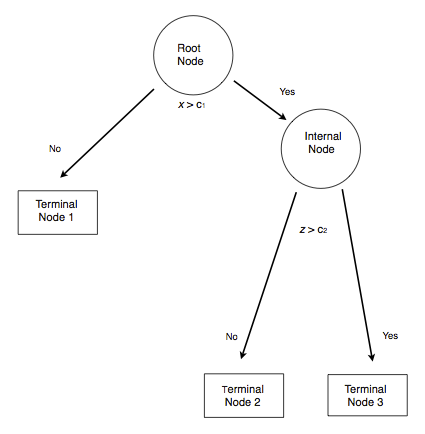
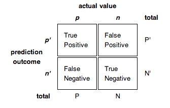

```{r install, eval=FALSE, include=FALSE}
# Install libraryd packages
install.packages(c('mice','VIM','ggplot2'))
```

```{r setup, include=FALSE}
library(ggplot2)
library(grid)
library(VIM)
library(mice)
library(reshape2)

source('../config.R')

source('../R/roc.r')

library(tree)
library(rpart)
library(party)
library(randomForest)
library(randomForestExplainer)
library(ggplot2)
library(mice)
library(ROCR)
library(TriMatch)
library(tidymodels)
library(caret)
library(patchwork)
library(ROCR)

par(mfrow = c(1,1), xpd = NA) #To prevent text from being clipped
par(bg="white", mai=c(1.2,1.5,1,1))

titanic <- read.csv('../course_data/titanic3.csv', stringsAsFactors = FALSE)
titanic$sex <- as.factor(titanic$sex)
titanic.mice <- mice::mice(titanic[,c("pclass","sex","age","sibsp")], m=1)
titanic <- cbind(survived=titanic$survived, mice::complete(titanic.mice))

titanic.split <- rsample::initial_split(titanic, strata = 'survived')
titanic.train <- rsample::training(titanic.split)
titanic.valid <- rsample::testing(titanic.split)

calif <- read.table('../course_data/cadata.dat', header=TRUE)
price.quintiles <- quantile(calif$MedianHouseValue, props = seq(0, 1, 0.2))
calif$cut.prices <- cut(calif$MedianHouseValue, price.quintiles, include.lowest=TRUE)
calif.split <- rsample::initial_split(calif, strata = 'cut.prices')
calif.train <- rsample::training(calif.split)
calif.valid <- rsample::testing(calif.split)

```


class: center, middle, inverse, title-slide

# `r metadata$title`
## `r metadata$subtitle`
### `r metadata$author`
### `r metadata$date`


---
# Classification and Regression Trees

The goal of CART methods is to find best predictor in X of some outcome, y. CART methods do this recursively using the following procedures:

* Find the best predictor in X for y.
* Split the data into two based upon that predictor.
* Repeat 1 and 2 with the split data sets until a stopping criteria has been reached.

There are a number of possible stopping criteria including: Only one data point remains.

* All data points have the same outcome value.
* No predictor can be found that sufficiently splits the data.

---
# Recursive Partitioning Logic of CART

.pull-left[
Consider the scatter plot to the right with the following characteristics:

* Binary outcome, G, coded “A” or “B”.
* Two predictors, x and z
* The vertical line at z = 3 creates the first partition.
* The double horizontal line at x = -4 creates the second partition.
* The triple horizontal line at x = 6 creates the third partition.
]
.pull-right[

]

---
# Tree Structure

.pull-left[
* The root node contains the full data set.
* The data are split into two mutually exclusive pieces. Cases where x > ci go to the right, cases where x <= ci go to the left.
* Those that go to the left reach a terminal node.
* Those on the right are split into two mutually exclusive pieces. Cases where z > c2 go to the right and terminal node 3; cases where z <= c2 go to the left and terminal node 2.
]
.pull-right[

]

---
# Sum of Squared Errors

The sum of squared errors for a tree *T* is:

$$S=\sum _{ c\in leaves(T) }^{  }{ \sum _{ i\in c }^{  }{ { (y-{ m }_{ c }) }^{ 2 } }  }$$

Where, ${ m }_{ c }=\frac { 1 }{ n } \sum _{ i\in c }^{  }{ { y }_{ i } }$, the prediction for leaf \textit{c}.

Or, alternatively written as:

$$S=\sum _{ c\in leaves(T) }^{  }{ { n }_{ c }{ V }_{ c } }$$

Where $V_{c}$ is the within-leave variance of leaf \textit{c}.

Our goal then is to find splits that minimize S.

---
# Advantages of CART Methods

* Making predictions is fast.

* It is easy to understand what variables are important in making predictions.

* Trees can be grown with data containing missingness. For rows where we cannot reach a leaf node, we can still make a prediction by averaging the leaves in the sub-tree we do reach.

* The resulting model will inherently include interaction effects. There are many reliable algorithms available.

---
# Regression Trees

In this example we will predict the median California house price from the house’s longitude and latitude.

```{r}
str(calif)
```

---
# Tree 1

```{r}
treefit <- tree(log(MedianHouseValue) ~ Longitude + Latitude, data=calif)
plot(treefit); text(treefit, cex=0.75)
```

---
# Tree 1

```{r, echo=FALSE, fig.height = 7}
price.deciles <- quantile(calif$MedianHouseValue, 0:9/9)
cut.prices <- cut(calif$MedianHouseValue, price.deciles, include.lowest=TRUE)
plot(calif$Longitude, calif$Latitude, col=grey(10:2/11)[cut.prices], pch=20, 
	 xlab="Longitude", ylab="Latitude")
partition.tree(treefit, ordvars=c("Longitude","Latitude"), add=TRUE)
```

---
# Tree 1

```{r}
summary(treefit)
```

Here “deviance” is the mean squared error, or root-mean-square error of $\sqrt{.166} =  0.41$.

---
# Tree 2, Reduce Minimum Deviance

We can increase the fit but changing the stopping criteria with the mindev parameter.

```{r}
treefit2 <- tree(log(MedianHouseValue) ~ Longitude + Latitude, data=calif, mindev=.001)
summary(treefit2)
```

With the larger tree we now have a root-mean-square error of 0.32.

---
# Tree 2, Reduce Minimum Deviance

```{r, echo=FALSE, fig.height = 7}
plot(calif$Longitude, calif$Latitude, col=grey(10:2/11)[cut.prices], 
pch=20, xlab="Longitude", ylab="Latitude")
partition.tree(treefit2, ordvars=c("Longitude","Latitude"), add=TRUE)
```

---
# Tree 3, Include All Variables

However, we can get a better fitting model by including the other variables.

```{r}
treefit3 <- tree(log(MedianHouseValue) ~ ., data=calif)
summary(treefit3)
```

With all the available variables, the root-mean-square error is 0.11.

---
# Classification Trees

* `pclass`: Passenger class (1 = 1st; 2 = 2nd; 3 = 3rd)
* `survival`: A Boolean indicating whether the passenger survived or not (0 = No; 1 = Yes); this is our target
* `name`: A field rich in information as it contains title and family names
* `sex`: male/female
* `age`: Age, a significant portion of values are missing
* `sibsp`: Number of siblings/spouses aboard
* `parch`: Number of parents/children aboard
* `ticket`: Ticket number.
* `fare`: Passenger fare (British Pound).
* `cabin`: Does the location of the cabin influence chances of survival?
* `embarked`: Port of embarkation (C = Cherbourg; Q = Queenstown; S = Southampton)
* `boat`: Lifeboat, many missing values
* `body`: Body Identification Number
* `home.dest`: Home/destination

---
# Classification using `rpart`

```{r}
(titanic.rpart <- rpart(survived ~ pclass + sex + age + sibsp,
   data=titanic.train))
```

---
# Classification using `rpart`

```{r}
plot(titanic.rpart); text(titanic.rpart, use.n=TRUE, cex=1)
```

---
# Classification using `ctree`

```{r}
(titanic.ctree <- ctree(survived ~ pclass + sex + age + sibsp, data=titanic.train))
```

---
# Classification using `ctree`

```{r}
plot(titanic.ctree)
```


---
# Receiver Operating Characteristic (ROC) Graphs

.pull-left[
In a classification model, outcomes are either as positive (*p*) or negative (*n*). There are then four possible outcomes:

* **true positive** (TP) The outcome from a prediction is *p* and the actual value is also *p*.
* **false positive** (FP) The actual value is *n*.
* **true negative** (TN) Both the prediction outcome and the actual value are *n*.
* **false negative** (FN) The prediction outcome is *n* while the actual value is *p*.

]
.pull-right[

]

---
# ROC Curve

.center[

]

---
# Ensemble Methods

Ensemble methods use multiple models that are combined by weighting, or averaging, each individual model to provide an overall estimate. Each model is a random sample of the sample. Common ensemble methods include:

* *Boosting* - Each successive trees give extra weight to points incorrectly predicted by earlier trees. After all trees have been estimated, the prediction is determined by a weighted “vote” of all predictions (i.e. results of each individual tree model).

* *Bagging* - Each tree is estimated independent of other trees. A simple “majority vote” is take for the prediction.

* *Random Forests* - In addition to randomly sampling the data for each model, each split is selected from a random subset of all predictors.

* *Super Learner* - An ensemble of ensembles. See https://cran.r-project.org/web/packages/SuperLearner/vignettes/Guide-to-SuperLearner.html

---
class: font90
# Random Forests

The random forest algorithm works as follows:

1. Draw $n_{tree}$ bootstrap samples from the original data.

2. For each bootstrap sample, grow an unpruned tree. At each node, randomly sample $m_{try}$ predictors and choose the best split among those predictors selected<footnote>Bagging is a special case of random forests where $m_{try} = p$ where *p* is the number of predictors</footnote>.

3. Predict new data by aggregating the predictions of the ntree trees (majority votes for classification, average for regression).

Error rates are obtained as follows:

1. At each bootstrap iteration predict data not in the bootstrap sample (what Breiman calls “out-of-bag”, or OOB, data) using the tree grown with the bootstrap sample.

2. Aggregate the OOB predictions. On average, each data point would be out-of-bag 36% of the times, so aggregate these predictions. The calculated error rate is called the OOB estimate of the error rate.

---
# Random Forests: Titanic

```{r titanicRF, cache=TRUE}
titanic.rf <- randomForest(factor(survived) ~ pclass + sex + age + sibsp,
						   data = titanic.train,
						   ntree = 5000,
						   importance = TRUE)
```

```{r}
importance(titanic.rf)
```

---
# Random Forests: Titanic (cont.)

```{r}
importance(titanic.rf)
```


---
# Random Forests: Titanic

```{r randomForestExplainer, cache=TRUE}
min_depth_frame <- min_depth_distribution(titanic.rf)
```


```{r, fig.width = 11, fig.height=5}
plot_min_depth_distribution(min_depth_frame)
```


---
class: left, font140
# One Minute Paper

.pull-left[
1. What was the most important thing you learned during this class?
2. What important question remains unanswered for you?
]
.pull-right[
```{r, echo=FALSE, fig.width=5, fig.height=5}
qrcode::qr_code(one_minute_paper) |> plot(col = c('#FAFAFA', 'black'))
```
]

`r one_minute_paper`


